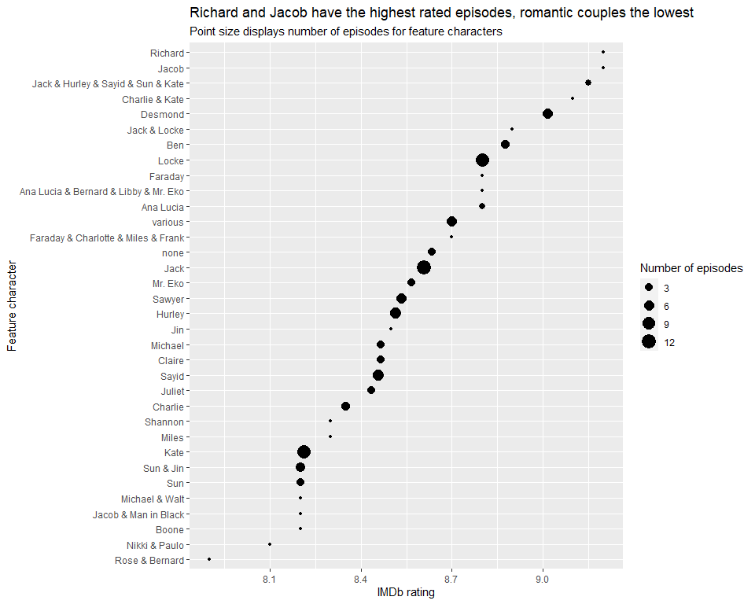

### LOST episode analysis and IMDb rating prediction

``` r
library(tidyverse)
library(lubridate)
```

``` r
lost <- read_csv("data/lost_data.csv")
```

<br />

### LOST episode ratings

``` r
lost %>%
    ggplot(aes(avg_rating)) +
    geom_histogram() +
    labs(x = "IMDb rating",
         y = NULL,
         title = "LOST episodes ranked by IMDb rating")
```


``` r
lost %>%
    mutate(title = fct_reorder(title, avg_rating)) %>%
    ggplot(aes(avg_rating, title)) +
    geom_point() +
    labs(x = "IMDb rating",
         y = NULL,
         title = "LOST episodes ranked by IMDb rating") +
    theme(axis.text.y = element_text(size = 8))
```


<br />

### Episode ratings by season

``` r
lost %>%
    mutate(episode_number = row_number()) %>%
    ggplot(aes(episode_number, avg_rating, color = factor(season))) +
    geom_point(size = 3) +
    geom_smooth(size = 1.5) +
    geom_smooth(aes(group = 1), size = 1.5) +
    labs(x = "Episode",
         y = "IMDb rating", 
         color = "Season",
         title = "Most seasons of LOST end on a high note") +
    scale_x_continuous(n.breaks = 10)
```


<br />

### Which feature chraracter(s) have the best LOST episodes?

``` r
lost %>%
    group_by(feature_character) %>%
    summarize(avg_rating = mean(avg_rating),
              n = n()) %>%
    mutate(feature_character = fct_reorder(feature_character, avg_rating)) %>%
    ggplot(aes(avg_rating, feature_character, size = n)) +
    geom_point() +
    labs(x = "IMDb rating",
         y = "Feature character", 
         size = "Number of episodes",
         title = "Richard and Jacob have the highest rated episodes, romantic couples the lowest",
         subtitle = "Point size displays number of episodes for feature characters")
```



<br />

### Which directors make the best LOST episodes?

``` r
lost %>%
    group_by(director) %>%
    summarize(avg_rating = mean(avg_rating),
              n = n()) %>%
    mutate(director = fct_reorder(director, avg_rating)) %>%
    ggplot(aes(avg_rating, director, size = n)) +
    geom_point() +
    labs(x = "IMDb rating",
         y = "Director", 
         size = "Number of episodes",
         title = "J.J. Abrams directed the best LOST episode",
         subtitle = "Point size displays number of episodes for feature characters")
```


<br />

### Which writers make the best LOST episodes?

``` r
lost %>%
    separate_rows(writer, sep = " & ") %>% 
    group_by(writer) %>%
    summarize(avg_rating = mean(avg_rating),
              n = n()) %>%
    mutate(writer = fct_reorder(writer, avg_rating)) %>%
    ggplot(aes(avg_rating, writer, size = n)) +
    geom_point() +
    labs(x = "IMDb rating",
         y = "Writer", 
         size = "Number of episodes",
         title = "Jeffrey Lieber wrote the best LOST episode",
         subtitle = "Point size displays number of episodes for feature characters")
```


<br />

### Are better episodes related to more viewers?

``` r
lost %>%
    ggplot(aes(viewers, avg_rating)) +
    geom_point() +
    labs(x = "Views (millions)",
         y = "IMDb rating") +
    geom_smooth() +
    labs(title = "More viewers does not mean better ratings")
```


<br />

### What are the most common words for each season of lost?

``` r
library(tidytext)

lost_words <- lost %>%
    unnest_tokens(word, content)

lost_words %>%
    count(season, word, sort = TRUE) %>%
    anti_join(stop_words) %>%
    filter( ! word %in% c("lost", "episode", "episodes", "season")) %>%
    group_by(season) %>%
    slice_max(n, n = 15) %>%
    ungroup() %>% 
    mutate(word = reorder_within(word, n, season)) %>%
    mutate(season = paste("Season", season)) %>%
    ggplot(aes(n, word, fill = factor(season))) +
    geom_col() +
    facet_wrap(~season, scales = "free_y") +
    scale_y_reordered() +
    theme(legend.position = "none") +
    labs(x = "Count",
         y = "Word")
```


<br />

### What are the most characteristic words for each season of lost?

``` r
library(tidylo)

lost_words %>%
    count(season, word, sort = TRUE) %>%
    bind_log_odds(season, word, n) %>%
    group_by(season) %>%
    slice_max(log_odds_weighted, n = 15) %>%
    ungroup() %>% 
    mutate(word = reorder_within(word, log_odds_weighted, season)) %>%
    mutate(season = paste("Season", season)) %>%
    ggplot(aes(log_odds_weighted, word, fill = factor(season))) +
    geom_col() +
    facet_wrap(~season, scales = "free_y") +
    scale_y_reordered() +
    theme(legend.position = "none") +
    labs(x = "Count",
         y = "Word")
```


<br />

### Predict IMDb ratings of LOST episodes

``` r
library(tidymodels)

set.seed(12345)
split <- initial_split(lost, strata = avg_rating)

train <- training(split)
test <- testing(split)

folds <- vfold_cv(lost)
```

<br />

### Check null regression model (e.g., predict the mean) to establish baseline error rate

``` r
#basic recipe for null model
base_rec <- train %>%
    recipe(avg_rating ~ season + episode + director + content) 

rec <- base_rec %>%
    step_string2factor(director) %>%
    step_unknown(director) %>%
    step_other(director, threshold = tune()) %>%
    step_dummy(director)

library(textrecipes)

text_rec <- rec %>%
    step_tokenize(content) %>%
    step_tokenfilter(content, max_tokens = tune()) %>%
    step_tfidf(content)

null_regression <- null_model() %>%
  set_engine("parsnip") %>%
  set_mode("regression")

null_wf <- workflow() %>%
    add_recipe(base_rec) %>%
    add_model(null_regression)

null_results <- tune_grid(
  null_wf,
  folds,
  metrics = metric_set(rmse))
```

    ## Warning: No tuning parameters have been detected, performance will be evaluated using the resamples with no tuning. Did you want to
    ## [tune()] parameters?

``` r
null_results %>% collect_metrics()
```

    ## # A tibble: 1 x 6
    ##   .metric .estimator  mean     n std_err .config             
    ##   <chr>   <chr>      <dbl> <int>   <dbl> <chr>               
    ## 1 rmse    standard   0.437    10  0.0253 Preprocessor1_Model1

The baseline error rate using RMSE using a null model is 0.437

<br />

### Build and train glmnet regression model

``` r
glm_model <- linear_reg(penalty = tune(),
                        mixture = tune()) %>%
    set_engine("glmnet") %>%
    set_mode("regression")

glm_wf <- workflow() %>%
    add_recipe(text_rec) %>%
    add_model(glm_model)

set.seed(54321)
glm_grid <- glm_wf %>%
    parameters() %>%
    update(max_tokens = max_tokens(range = c(1, 2000))) %>%
    grid_random(size = 50)

glm_results <- tune_grid(
    glm_wf,
    folds,
    metrics = metric_set(rmse), 
    grid = glm_grid)

glm_results %>% collect_metrics() %>% arrange(mean)
```

    ## # A tibble: 50 x 10
    ##     penalty mixture threshold max_tokens .metric .estimator  mean     n std_err .config              
    ##       <dbl>   <dbl>     <dbl>      <int> <chr>   <chr>      <dbl> <int>   <dbl> <chr>                
    ##  1 1.26e- 6   0.850   0.0724        1261 rmse    standard   0.291    10  0.0308 Preprocessor44_Model1
    ##  2 3.31e- 6   0.650   0.0622        1314 rmse    standard   0.292    10  0.0288 Preprocessor20_Model1
    ##  3 5.18e- 5   0.273   0.00499       1271 rmse    standard   0.299    10  0.0252 Preprocessor19_Model1
    ##  4 2.19e- 2   0.197   0.0158        1366 rmse    standard   0.305    10  0.0215 Preprocessor28_Model1
    ##  5 5.76e- 4   0.895   0.00943       1562 rmse    standard   0.306    10  0.0199 Preprocessor12_Model1
    ##  6 9.65e- 6   0.779   0.0936        1159 rmse    standard   0.311    10  0.0200 Preprocessor02_Model1
    ##  7 1.68e- 4   0.740   0.0541         941 rmse    standard   0.311    10  0.0232 Preprocessor47_Model1
    ##  8 1.33e-10   0.172   0.0142        1144 rmse    standard   0.317    10  0.0167 Preprocessor29_Model1
    ##  9 2.33e- 9   0.334   0.0898        1178 rmse    standard   0.320    10  0.0210 Preprocessor11_Model1
    ## 10 7.37e- 4   0.221   0.0982        1566 rmse    standard   0.320    10  0.0196 Preprocessor43_Model1
    ## # ... with 40 more rows

``` r
glm_results %>% autoplot()
```


<br />

### Build and train SVM regression model

``` r
svm_model <- svm_rbf(cost = tune(),
                     rbf_sigma = tune(),
                     margin = tune()) %>%
  set_engine("kernlab") %>%
  set_mode("regression")

svm_wf <- workflow() %>%
    add_recipe(text_rec) %>%
    add_model(svm_model)

set.seed(54321)
svm_grid <- svm_wf %>%
    parameters() %>%
    update(max_tokens = max_tokens(range = c(1, 2000))) %>%
    grid_random(size = 50)

svm_results <- tune_grid(
  svm_wf,
  folds,
  metrics = metric_set(rmse), 
  grid = svm_grid
)

svm_results %>% collect_metrics() %>% arrange(mean)
```

    ## # A tibble: 50 x 11
    ##      cost  rbf_sigma margin threshold max_tokens .metric .estimator  mean     n std_err .config              
    ##     <dbl>      <dbl>  <dbl>     <dbl>      <int> <chr>   <chr>      <dbl> <int>   <dbl> <chr>                
    ##  1 18.6   0.0000240  0.0673    0.0480       1536 rmse    standard   0.339    10  0.0235 Preprocessor50_Model1
    ##  2  7.97  0.0000896  0.0863    0.0768       1927 rmse    standard   0.344    10  0.0227 Preprocessor06_Model1
    ##  3  2.37  0.00172    0.0996    0.0251        377 rmse    standard   0.367    10  0.0269 Preprocessor38_Model1
    ##  4 15.5   0.00101    0.0123    0.0432       1737 rmse    standard   0.393    10  0.0244 Preprocessor25_Model1
    ##  5 23.3   0.00654    0.0874    0.0482        298 rmse    standard   0.396    10  0.0248 Preprocessor33_Model1
    ##  6 11.0   0.0000299  0.190     0.0675        442 rmse    standard   0.398    10  0.0237 Preprocessor23_Model1
    ##  7  1.40  0.00361    0.0749    0.0170        856 rmse    standard   0.411    10  0.0243 Preprocessor27_Model1
    ##  8  9.01  0.00000534 0.0481    0.0327       1815 rmse    standard   0.411    10  0.0234 Preprocessor48_Model1
    ##  9  0.632 0.00184    0.108     0.0160       1292 rmse    standard   0.414    10  0.0244 Preprocessor47_Model1
    ## 10 17.6   0.00611    0.183     0.0613        837 rmse    standard   0.417    10  0.0241 Preprocessor45_Model1
    ## # ... with 40 more rows

<br />

### Train final glmnet regression model on all of training data using best parameters and evaluate on the test set

``` r
glm_final <- glm_wf %>%
    finalize_workflow(select_best(glm_results, metric = "rmse")) %>%
    last_fit(split = split)

glm_final %>% collect_metrics()
```

    ## # A tibble: 2 x 4
    ##   .metric .estimator .estimate .config             
    ##   <chr>   <chr>          <dbl> <chr>               
    ## 1 rmse    standard       0.334 Preprocessor1_Model1
    ## 2 rsq     standard       0.511 Preprocessor1_Model1

<br /> <br /> <br /> <br /> <br /> <br />
